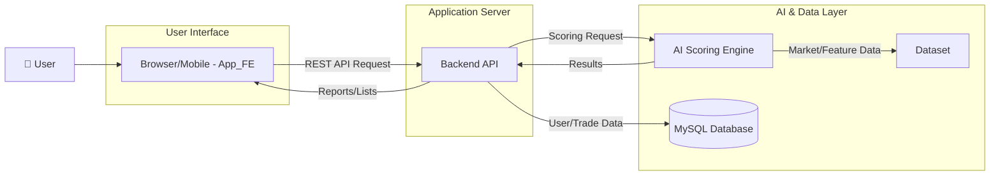

## AI 기반 개인 맞춤형 트레이딩 코칭 시스템: MAIL (My AI Ledger)

[여기에 서비스의 핵심 가치를 보여주는 로고나 스크린샷 이미지를 삽입하세요]

MAIL은 개인 투자자의 모든 매매를 데이터로 구조화하고, AI가 전문가 페르소나의 시각에서 객관적으로 평가·코칭하는 시스템입니다. 이 저장소에는 다음 4개 서비스가 모듈형으로 포함되어 있습니다.

- @App_FE → `AinvestLog` (React Native/Expo 프론트엔드)
- @Backend → `Trader_CHO` (Spring Boot 백엔드 API)
- @AI → `AI` (FastAPI 기반 AI 스코어링/리포트 엔진)
- @Dataset → `Dataset` (데이터 적재/지표 산출 파이프라인)

### 1. 🚀 서비스 소개 (Service Introduction)

- 무엇을 해결하는가? (The Problem)

  - 대부분의 투자자는 감정적 의사결정, 일관성 부족, 사후 복기의 부재로 인해 동일한 실수를 반복합니다. 거래 과정에서 “왜 그때 매수/매도했는가?”를 객관적으로 평가해줄 피드백 시스템이 없어서 장기적인 성장을 방해받습니다.

- 어떻게 해결하는가? (Our Solution)

  - MAIL은 모든 매매를 정량·정성 데이터로 기록/분석하고, AI가 전문가 페르소나 관점에서 Context(시장·환경)와 Timing(시점·실행)을 이중 평가하여 점수와 코칭을 제공합니다. @AI 엔진은 LangChain + OpenAI 기반으로 프롬프트 체인을 구성하고, Pydantic 스키마를 통해 일관된 리포트 포맷을 생성합니다. 또한 @Backend의 스코어링 룰셋(페르소나 루브릭)과 결합되어 다각도의 피드백을 제공합니다.

- 핵심 가치 (Core Value)
  - 개인화된 AI 트레이딩 코치: 사용자의 투자 성향을 파악하고, 감정적 실수를 줄이며, 재현 가능한 원칙을 수립하도록 돕습니다. 주간/월간 리포트로 복기를 촉진하고, 일관된 기준과 데이터 중심의 매매를 가능하게 합니다.

### 2. ✨ 주요 기능 (Key Features)

- 📊 AI 스코어링 분석

  - 모든 매매에 대해 Context(환경) 점수와 Timing(시점) 점수를 이중으로 산출합니다. (@Dataset의 지표 계산과 @Backend의 스코어링 룰, @AI의 LLM 체인 결합)
  - 8가지 전문가 페르소나 관점의 입체 분석:
    - balanced-40-60, trend-follower-40-60, mean-reversion-40-60, breakout-40-60
    - stable-50-50, macro-trend-50-50, extreme-reversal-50-50, all-in-one-50-50

- 📈 매매 기록 및 시각화

  - @App_FE는 캘린더 기반으로 거래 기록을 관리하고, 수익률·승률 등 지표를 대시보드/카드로 시각화합니다.
  - 예시 API 사용 (@App_FE → @Backend):
    - 리포트 조회: `GET /api/reports/weekly`, `GET /api/reports/weekly/list`, `GET /api/reports/weekly/{id}`
    - 월간 리포트: `GET /api/reports/monthly`, `GET /api/reports/monthly/list`, `GET /api/reports/monthly/{id}`
    - 종목 목록: `GET /api/stock-items`
    - 거래 생성/조회/수정: `POST /api/trades`, `GET /api/trades`, `PATCH /api/trades/{id}`

- 🤖 개인화 피드백 시스템
  - 과거 매매 패턴을 분석하여 사용자 성향을 진단하고, 해당 성향에 적합한 페르소나의 분석을 우선 제공.
  - @AI는 주간/월간 요약 리포트를 Pydantic 스키마(`WeeklyReport`, `MonthlyReport`)에 맞춰 안정적으로 생성.

참고: @App_FE의 주요 화면 및 연동 코드

- `src/screens/AiReportScreen.tsx`에서 리포트 부트스트랩 및 기간 이동, 상세 리포트 조회 로직 구현
- `src/hooks/useSymbolSearch.ts`에서 `GET /api/stock-items`로 자동완성 데이터 수신
- `src/utils/api.ts`에서 `API_BASE_URL` 기반 axios 인스턴스 구성 (예: `API_BASE_URL=http://localhost:8080/api`)

### 3. 🏛️ 시스템 아키텍처 (System Architecture)

다음은 @App_FE, @Backend, @AI, @Dataset 간 상호작용을 요약한 데이터·요청 흐름입니다.



구체 동작

- @Dataset: FMP API 등 외부 데이터에서 일/분봉 시계열 수집, 기술 지표 계산(RSI, MA Stack, Stochastic, Bollinger, Keltner, OBV 등) 후 `daily_market_data`, `intraday_market_data` 등 테이블에 저장
- @Backend: 스코어링 루브릭(페르소나) 설정(`application.yml`의 `scoring.rubrics`)과 DB의 거래/지표를 활용해 리포트/목록 제공, 거래 CRUD 제공
- @AI: LangChain + OpenAI 기반 프롬프트 체인(`app/ai/chain.py`)으로 Trade/Weekly/Monthly 리포트 생성. `/health`, `/test` 등의 상태/테스트 엔드포인트 제공
- @App_FE: Expo/React Native로 사용자 인터페이스 제공. 캘린더·리스트·카드 컴포넌트로 리포트와 거래를 시각화 및 입력

### 4. 💻 기술 스택 (Tech Stack)

| 구분        | 기술                                                              | 레포지토리                        |
| ----------- | ----------------------------------------------------------------- | --------------------------------- |
| Front-End   | React Native (Expo), TypeScript, React Navigation, Axios          | @App_FE (`AinvestLog`)            |
| Back-End    | Java 21, Spring Boot 3.5, Spring MVC, Spring Data JPA, Validation | @Backend (`Trader_CHO`)           |
| AI Engine   | Python 3.11, FastAPI, LangChain, OpenAI (ChatOpenAI), Pydantic    | @AI (`AI`)                        |
| Database    | MySQL 8 (JDBC: `com.mysql:mysql-connector-j`)                     | @Backend (`Trader_CHO`), @Dataset |
| Data Source | REST(FMP API), JSON, MySQL 테이블, 지표 파이프라인(Pandas/Numpy)  | @Dataset (`Dataset`)              |

근거 코드 스냅샷

- @App_FE: `AinvestLog/package.json` (Expo ~53, React 19, RN 0.79, axios 등)
- @Backend: `Trader_CHO/build.gradle` (spring-boot-starter-web/data-jpa/validation, MySQL driver)
- @AI: `AI/requirements.txt`, `AI/app/main.py`, `AI/app/ai/llm_model.py`
- @Dataset: `Dataset/save_market_data.py`, `Dataset/evaluation/engine.py`, `Dataset/services/db.py`

### 5. 🛠️ 로컬 개발 환경 설정 (Local Development Setup)

- 사전 준비 (Prerequisites)

  - JDK 21 (Spring Boot 3.5)
  - Node.js 18 LTS 이상, npm (또는 pnpm/yarn), Expo CLI
  - Python 3.11, pip/venv
  - MySQL 8.x (로컬 인스턴스 또는 Docker)
  - OpenAI API Key (@AI 엔진 테스트/리포트 생성용)

- 레포지토리 클론 (예시)

  - 단일 모노리포 구성: 이 저장소 루트에 이미 `AinvestLog`, `Trader_CHO`, `AI`, `Dataset` 디렉토리가 포함되어 있습니다.
  - 다중 레포로 운영 시:
    ```bash
    git clone <FE_REPO_URL> App_FE
    git clone <BE_REPO_URL> Backend
    git clone <AI_REPO_URL> AI
    git clone <DATASET_REPO_URL> Dataset
    ```

- 실행 순서 및 방법

  1. Backend (@Backend → `Trader_CHO`)

  - DB 연결 설정: `Trader_CHO/src/main/resources/application.yml`
    - 예) `spring.datasource.url=jdbc:mysql://localhost:3306/<db>?...`
    - `scoring.active-rubric`로 기본 페르소나 룰 지정 가능
  - 실행 (Windows):
    ```bash
    cd Trader_CHO
    gradlew.bat bootRun
    ```
  - 실행 (macOS/Linux):
    ```bash
    cd Trader_CHO
    ./gradlew bootRun
    ```

  2. Front-End (@App_FE → `AinvestLog`)

  - 환경파일: `AinvestLog/.env`
    - 예) `API_BASE_URL=http://localhost:8080/api` ← 슬래시 포함 주의 (FE는 `/reports`, `/stock-items` 등 상대 경로 호출)
  - 의존성 및 실행:
    ```bash
    cd AinvestLog
    npm install
    npx expo start
    ```

  3. AI 서버 (@AI → `AI`)

  - 가상환경 및 의존성:
    ```bash
    cd AI
    python -m venv .venv
    .venv\Scripts\activate  # (Windows)
    pip install -r requirements.txt
    ```
  - 환경파일 `AI/.env` 예시:
    ```
    OPENAI_API_KEY=YOUR_OPENAI_API_KEY
    OPENAI_MODEL_NAME=gpt-4o-mini
    OPENAI_TEMPERATURE=0.7
    OPENAI_MAX_TOKENS=1000
    ```
  - 실행:
    ```bash
    python run.py
    # 또는
    uvicorn app.main:app --reload --host 0.0.0.0 --port 8000
    ```
  - 헬스/테스트: `GET http://localhost:8000/health`, `GET http://localhost:8000/test`

  4. Dataset 파이프라인 (@Dataset → `Dataset`)

  - DB 접속 설정: `Dataset/config/db_config.py`
  - 대상 티커 설정: `Dataset/config/tickers_to_process.json`
  - 실행:
    ```bash
    cd Dataset
    python save_market_data.py
    # (필요 시) 평가/저장 엔진 샘플 실행
    python -m evaluation.engine --trade_id 1
    ```

포트/주소 정리 (기본 예시)

- Backend: `http://localhost:8080/api`
- Frontend(API_BASE_URL): `http://localhost:8080/api`
- AI: `http://localhost:8000`
- MySQL: `localhost:3306`

### 6. 🗺️ 향후 로드맵: ML 모델로의 고도화

- 규칙 기반의 한계

  - 현재는 기술 지표·룰·LLM 프롬프트를 결합해 “설명 가능한 점수”와 코칭을 제공합니다. 다만 정태적 가중치/룰은 시장 국면 변화에 대한 적응력이 제한될 수 있습니다.

- 개선 목표

  - 설명 점수를 넘어 “매매 성공 확률”을 예측하는 모델로 확장합니다. 사용자별·시장상태별로 동적인 가중치와 전략 추천을 제공합니다.

- 핵심 기술

  - XGBoost 등의 검증된 트리 기반 모델로 초기 베이스라인 구축 → 시계열/특징 엔지니어링으로 정교화 → 필요 시 신경망/시퀀스 모델로 확장

- 3단계 로드맵
  1. 데이터 플랫폼 구축: @Dataset의 파이프라인을 강화하여 거래·시장·특징·성과 데이터를 학습용 피처 스토어로 일원화
  2. ML 모델 개발/검증: 베이스라인(XGBoost) 학습, 시뮬레이션 백테스트, 오프라인·온라인 검증 지표 설계(AUC, calibration 등)
  3. 시스템 통합/운영: @Backend에 추론 엔드포인트 추가, @AI와 통합하여 “설명 + 확률 예측” 하이브리드 코칭 제공, A/B 테스트와 모니터링 도입

---

문의/기여

- 이슈/기여(PR)는 각 모듈 레포지토리(@App_FE, @Backend, @AI, @Dataset) 단위로 등록해 주세요. 공통 아키텍처/데이터 모델 변경은 본 문서를 함께 갱신합니다.
