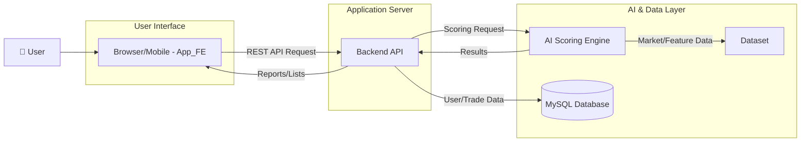

# 📊 매일 (My AI Ledger)

> **AI 기반 개인 맞춤형 트레이딩 코칭 시스템**  
> 데이터 기반 피드백과 전문가 페르소나 분석으로 당신의 투자 습관을 개선합니다.

<br/>

## 📌 서비스 개요
**매일 (My AI Ledger)** 은 개인 투자자의 **모든 매매를 데이터로 구조화** 하고, 
AI가 전문가의 시각에서 객관적으로 평가 및 코칭하는 시스템입니다. 감정에 휘둘리기 쉬운 투자를 데이터 기반의 명확한 기준으로 전환하여, 사용자가 장기적으로 성장할 수 있도록 돕습니다.


<br/>

## 💡 해결하려는 문제
대부분의 투자자는 감정적 의사결정, 일관성 부족, 그리고 복기(사후 분석)의 부재로 인해 같은 실수를 반복합니다. "왜 그때 매수/매도했을까?"에 대한 객관적인 피드백이 없어 장기적인 성장이 어렵습니다.


<br/>

## 🎯 매일의 해결책
- 📊 **AI 기반 스코어링 분석** : 모든 매매에 대해 전문가 페르소나 관점에서 평하여 점수를 제공합니다.
  
<br/>

- 📈 **매매 기록 및 시각화** : 캘린더를 통해 거래 기록을 직관적으로 관리하고, 수익률, 승률 등 주요 지표를 대시보드와 카드로 시각화하여 한눈에 파악할 수 있습니다.

<br/>

- 🤖 **주간/월간 리포트 작성** : AI가 주간/월간 리포트를 작성해 복기를 촉진하고, 일관된 기준과 데이터 중심의 매매를 가능하게 합니다.

<br/>


## ✨ 주요 기능
- ### 스코어링 분석: 전문가의 시선으로

  단순한 수익률 계산을 넘어, AI가 사용자의 모든 매매를 **Context(시장 환경)** 와 **Timing(매매 시점)** 이라는 두 가지 핵심 기준으로 깊이 있게 분석합니다.

  > * **Context 점수**: 매매 당시의 시장 상황이 당신의 전략에 얼마나 부합했는지 평가합니다.
  > * **Timing 점수**: 진입과 청산 시점이 얼마나 정교했는지 평가합니다.
  
  또한, **전문가 페르소나**의 관점에서 사용자의 매매를 입체적으로 진단합니다. 당신의 매매가 과연 `trend-follower`의 관점에서 훌륭했는지, 혹은 `breakout` 전략에 부합했는지 객관적인 시각을 제시합니다.

<br/>

- ### 직관적인 매매 기록 & 시각화
  **매일**을 통해 매매 기록을 캘린더에 간편하게 정리하고, **수익률, 승률 등 핵심 지표들을 대시보드와 카드로 한눈에 확인**할 수 있습니다. 시각화된 데이터는 사용자의 투자 성과를 명확하게 보여주며, 매매했을 당시의 판단들을 복기할 수 있습니다.

<br/>

- ### 리포트 작성
  매일의 AI는 한 주의 매매 패턴을 분석해 **주간 매매 분석 리포트**를 작성합니다. 이 리포트에는 각 매매에 대한 피드백과 향후 계획이 포함됩니다. <br>
  또한 각 주의 리포트로 **월간 매매 분석 리포트**를 작성합니다. 당월의 긍정적인 부분과 개선 요소를 보여줍니다.

<br/>

## 🏗️ 시스템 아키텍처


<br/>

## 📂 주요 레포지토리
| 모듈       | 설명 | 링크 |
|------------|------|------|
| App_FE    | React Native/Expo 기반 프론트엔드 | [Repo](https://github.com/organization/App_FE) |
| Backend   | Spring Boot 백엔드 API | [Repo](https://github.com/organization/Backend) |
| AI        | FastAPI 기반 LangChain + OpenAI 리포트 엔진 | [Repo](https://github.com/organization/AI) |
| Dataset   | 데이터 수집·지표 산출 파이프라인 | [Repo](https://github.com/organization/Dataset) |

**구체 동작**

- Dataset: FMP API 등 외부 데이터에서 일/분봉 시계열 수집, 기술 지표 계산(RSI, MA Stack, Stochastic, Bollinger, Keltner, OBV 등) 후 `daily_market_data`, `intraday_market_data` 등 테이블에 저장
- Backend: 스코어링 루브릭(페르소나) 설정(`application.yml`의 `scoring.rubrics`)과 DB의 거래/지표를 활용해 리포트/목록 제공, 거래 CRUD 제공
- AI: LangChain + OpenAI 기반 프롬프트 체인(`app/ai/chain.py`)으로 Trade/Weekly/Monthly 리포트 생성. `/health`, `/test` 등의 상태/테스트 엔드포인트 제공
- App_FE: Expo/React Native로 사용자 인터페이스 제공. 캘린더·리스트·카드 컴포넌트로 리포트와 거래를 시각화 및 입력

<br/>

## ⚙️ 기술 스택
- **Frontend**: React Native (Expo), TypeScript, React Navigation, Axios
- **Backend**: Java 21, Spring Boot 3.5, Spring MVC, Spring Data JPA, Validation
- **AI Engine**: Python 3.11, FastAPI, LangChain, OpenAI API, Pydantic
- **Database**: MySQL 8.x
- **Data Source**: FMP API, Pandas/Numpy 기반 지표 계산

<br/>

## 🚀 로컬 개발 환경 설정
### 사전 준비
- JDK 21
- Node.js 18 LTS 이상, npm 또는 yarn, Expo CLI
- Python 3.11
- MySQL 8.x
- OpenAI API Key

### 실행 순서
1. **Backend** (`Trader_CHO`)
   ```bash
   cd Trader_CHO
   ./gradlew bootRun
   ```
2. **Frontend** (`AinvestLog`)
   ```bash
   cd AinvestLog
   npm install
   npx expo start
   ```
3. **AI 서버**
   ```bash
   cd AI
   python -m venv .venv
   source .venv/bin/activate
   pip install -r requirements.txt
   python run.py
   ```
4. **Dataset 파이프라인**
   ```bash
   cd Dataset
   python save_market_data.py
   ```

<br/>

## 🗺️ 향후 로드맵
- **개인 맞춤형 전문가 페르소나**: 사용자의 매매 특징에 따른 성향을 분석하고, 이에 맞는 전문가 페르소나를 매칭합니다.
- **뉴스 기반 리포트**: 주식 뉴스 및 관련 소식을 주간/월간 분석에 활용합니다.
- **백테스트 & 모니터링**: 잘 평가한 데이터들을 바탕으로 스스로 학습할 수 있도록 자가 학습 플로우를 구성합니다.

<br/>

## 👥 기여자

<table>
  <tr>
    <td align="center" width="120px"><a href="https://github.com/prefer52"></a></td>
    <td align="center" width="120px"><a href="https://github.com/sssungjin"></a></td>
    <td align="center" width="120px"><a href="https://github.com/SangminHann"></a></td>
  </tr>
  <tr>
    <td align="center" width="120px"><a href="https://github.com/prefer52"><b>이선호</b></a></td>
    <td align="center" width="120px"><a href="https://github.com/sssungjin"><b>조성진</b></a></td>
    <td align="center" width="120px"><a href="https://github.com/SangminHann"><b>한상민</b></a></td>
  </tr>
  <tr>
    <td align="center" width="120px">AI 모델 개발</td>
    <td align="center" width="120px">Data, FE</td>
    <td align="center" width="120px">FE, BE</td>
  </tr>
</table>


<br/>

---

© 2025 MAIL (My AI Ledger). All rights reserved.
